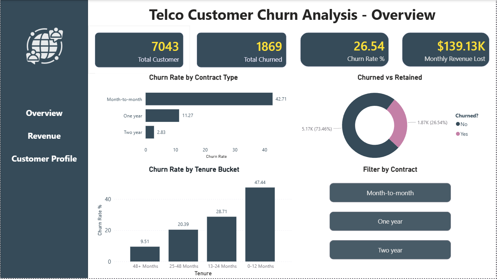
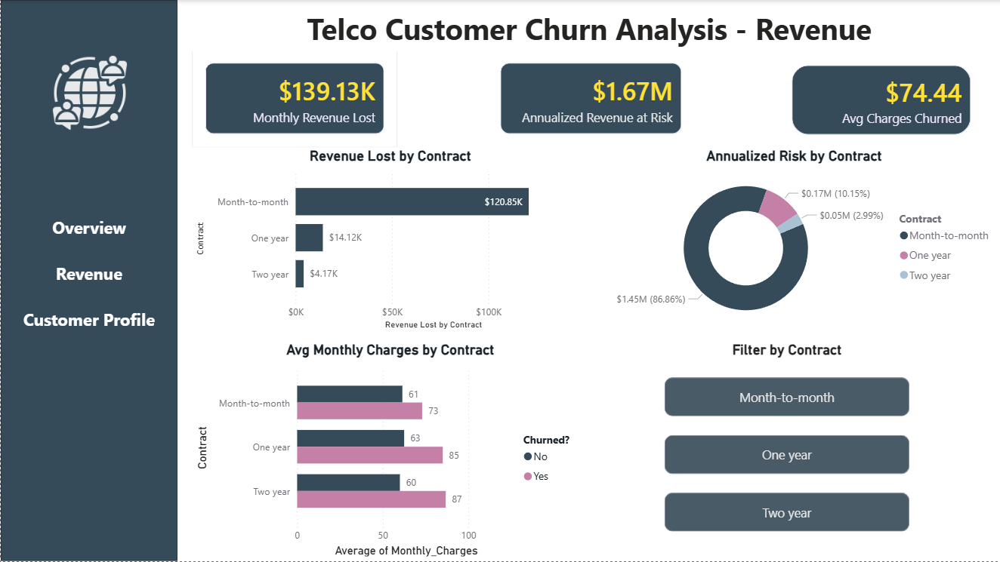
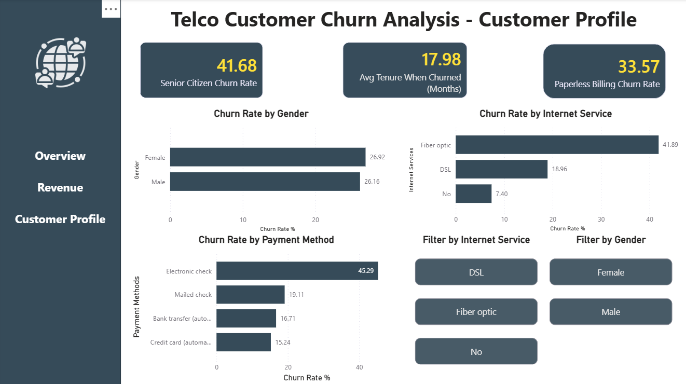
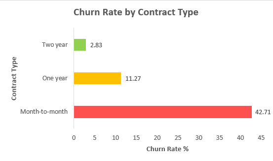
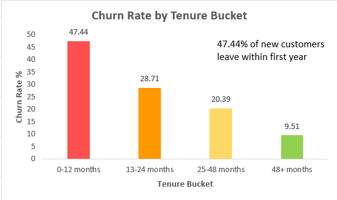
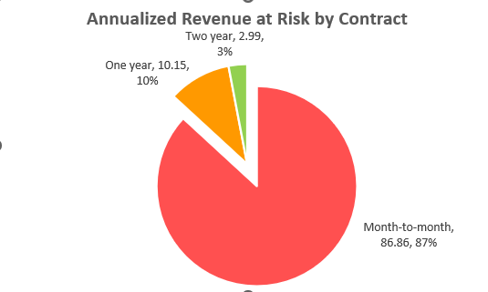
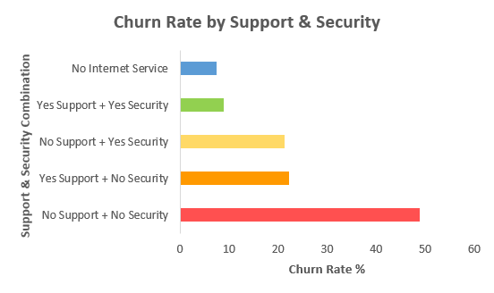

# 📊 Telco Customer Churn Analysis

> **Tools Used:** PostgreSQL · Microsoft Excel · Power BI  
> **Dataset:** IBM Telco Customer Churn (Kaggle) - 7,043 rows · 33 columns  
> **Project Type:** End-to-End Data Analytics Portfolio Project

---

## 📌 Table of Contents

- [Problem Statement](#-problem-statement)
- [Project Goals](#-project-goals)
- [Tools & Technologies](#-tools--technologies)
- [Project Structure](#-project-structure)
- [Dashboard Preview](#-dashboard-preview)
- [Key Findings](#-key-findings)
- [Excel Model](#-excel-model)
- [Business Recommendations](#-business-recommendations)
- [How to Run the SQL](#-how-to-run-the-sql)
- [Dataset](#-dataset)

---

## 🔍 Problem Statement

A telecom company is silently losing customers - and most businesses treat churn as a percentage on a slide. This project reframes the problem: **how much revenue is actually walking out the door, which customers are leaving, and what would it cost to stop them?**

The goal wasn't just to measure churn. It was to build a business case.

---

## 🎯 Project Goals

- Calculate the true financial cost of customer churn
- Identify which customer segments are most at risk
- Find the "why" behind churn using service and support data
- Build a retention ROI model to justify a campaign investment
- Present findings in an interactive Power BI dashboard

---

## 🛠 Tools & Technologies

| Tool | Purpose |
|---|---|
| **PostgreSQL** | Data storage, schema design, and analytical queries |
| **Microsoft Excel 2024** | Summary tables, revenue model, ROI calculator, charts |
| **Power BI Desktop** | Interactive 3-page dashboard |
| **GitHub** | Version control and portfolio presentation |

---

---

## 📺 Dashboard Preview

### Overview Page
> Headline churn metrics, contract breakdown, tenure lifecycle, and churned vs retained split.

---

### Revenue Page
> Financial impact of churn - monthly losses, annualized risk, and average charges by segment.

---

### Customer Profile Page
> Who is churning - broken down by gender, internet service type, and payment method.

---

## 🔑 Key Findings

### 1. Overall Churn Rate

The company is losing **26.54%** of its customers - that's **1,869 out of 7,043 people**. The telecom industry average sits around 15–20%, which means this company is operating significantly above the benchmark. That single number justifies everything that follows.

---

### 2. Contract Type - The Most Powerful Finding

| Contract | Total | Churned | Churn Rate | Avg Monthly Charges |
|---|---|---|---|---|
| Month-to-month | 3,875 | 1,655 | **42.71%** | $66.40 |
| One year | 1,473 | 166 | **11.27%** | $65.05 |
| Two year | 1,695 | 48 | **2.83%** | $60.77 |

Month-to-month customers churn at **15x the rate** of two-year subscribers. The striking detail? All three groups pay nearly the same monthly charges (~$60–66). Price is not the driver - **lack of commitment is.** And 88.6% of all churned customers come from this single segment.

---

### 3. Tenure Bucket - When Customers Leave

| Tenure | Total | Churned | Churn Rate |
|---|---|---|---|
| 0-12 months | 2,186 | 1,037 | **47.44%** |
| 13-24 months | 1,024 | 294 | **28.71%** |
| 25-48 months | 1,594 | 325 | **20.39%** |
| 48+ months | 2,239 | 213 | **9.51%** |

Nearly **1 in 2 new customers** leaves within the first year. Churn is front-loaded - 71.2% of all churners are lost before they even reach the 2-year mark. Customers who survive past 4 years are 5x less likely to leave than new customers.

---

### 4. Revenue at Risk - What This Actually Costs

| Contract | Monthly Revenue Lost | Annualized Risk | % of Total |
|---|---|---|---|
| Month-to-month | $120,847.10 | $1,450,165.20 | **86.86%** |
| One year | $14,118.45 | $169,421.40 | 10.15% |
| Two year | $4,165.30 | $49,983.60 | 2.99% |
| **Total** | **$139,130.85** | **$1,669,570.20** | 100% |

**$1.67 million** in annualized revenue is at risk - and 86.86% of that sits in one contract segment. The business is losing $139,000 every single month. Reducing month-to-month churn by just 10% would recover **$145,017 per year.**

---

### 5. Service Quality - The "Why" Layer

| Tech Support | Online Security | Total | Churn Rate |
|---|---|---|---|
| No | No | 2,553 | **48.96%** |
| Yes | No | 945 | 22.33% |
| No | Yes | 920 | 21.30% |
| Yes | Yes | 1,099 | **9.01%** |
| No Internet Service | No Internet Service | 1,526 | 7.40% |

Customers with neither Tech Support nor Online Security churn at **48.96%** - nearly 5x the rate of customers who have both services (9.01%). These are upsellable services the company already offers. Moving the 2,553 unprotected customers to both services could save approximately **$812,736 in annual retained revenue.**

---

## 📊 Excel Model

The Excel workbook contains 5 sheets designed to translate raw data into business decisions.

### ROI Calculator

| Input | Value |
|---|---|
| Total Customers | 7,043 |
| Monthly Churn Rate | 26.54% |
| Avg Monthly Revenue per Churned Customer | $74.44 |
| Customers Targeted per Month | 200 (assumed) |
| Cost per Customer | $15 (assumed) |
| Retention Success Rate | 30% (assumed) |

| Output | Value |
|---|---|
| Monthly Revenue at Risk | $14,888.00 |
| Campaign Cost (Monthly) | $3,000.00 |
| Customers Saved per Month | 60 |
| Revenue Saved per Month | $4,466.40 |
| Net Monthly Benefit | $1,466.40 |
| **ROI** | **48.88%** |
| **Annual Net Projection** | **$17,596.80** |

> For every $1 spent on retention, the company recovers $1.49 in saved revenue.

---

## 💡 Business Recommendations

Based on the analysis, here are five targeted actions ranked by potential impact:

**1. Convert month-to-month customers to annual contracts**
88.6% of churners are month-to-month. Offering a small incentive (one month free, a discount) to upgrade to an annual plan would directly address the root cause - not price, but lack of commitment.

**2. Bundle Tech Support + Online Security at onboarding**
New customers who sign up without these services churn at 48.96%. Making these part of a default onboarding bundle - even as a free trial - could dramatically reduce early-stage churn.

**3. Focus retention on the 0–12 month window**
47.44% of customers leave in year one. A structured 90-day and 6-month check-in program for new customers could significantly change the retention curve.

**4. Audit the Fiber Optic experience**
Every single one of the top 50 high-value churners used Fiber Optic internet. This suggests a service quality or competitive pricing issue specific to that segment - not the product itself, but how it's being delivered or priced.

**5. Incentivize automatic payment methods**
Electronic check users churn at 45.29% - 3x the rate of automatic payment customers. Offering a small monthly discount for switching to bank transfer or credit card auto-pay could reduce churn while also improving payment reliability.

---

## 🚀 How to Run the SQL

1. Install PostgreSQL and pgAdmin
2. Create a new database called `Telco_Customer_Churn_IBM`
3. Run `sql/00_create_table.sql` to create the schema
4. Import the CSV using pgAdmin's Import/Export tool:
   - Right-click `customer_churn` table → Import/Export
   - Format: CSV, Header: On, NULL string: ` ` (single space)
5. Run queries `01` through `06` in order

> ⚠️ The NULL string setting is important - the dataset contains blank spaces in `Total_Charges` for new customers with 0 tenure months.

---

## 📂 Dataset

**Source:** [IBM Telco Customer Churn - Kaggle](https://www.kaggle.com/datasets/yeanzc/telco-customer-churn-ibm-dataset)

- 7,043 customer records
- 33 columns covering demographics, services, billing, and churn status
- Includes churn reason, churn score, and customer lifetime value (CLTV)

---

## 📬 Contact

If you have any questions about this project or want to discuss the methodology, feel free to reach out via GitHub.

---

*This project was built as part of a data analytics portfolio. All business recommendations are based solely on the dataset provided and are intended for analytical demonstration purposes.*
